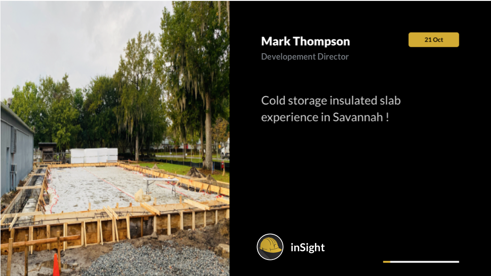
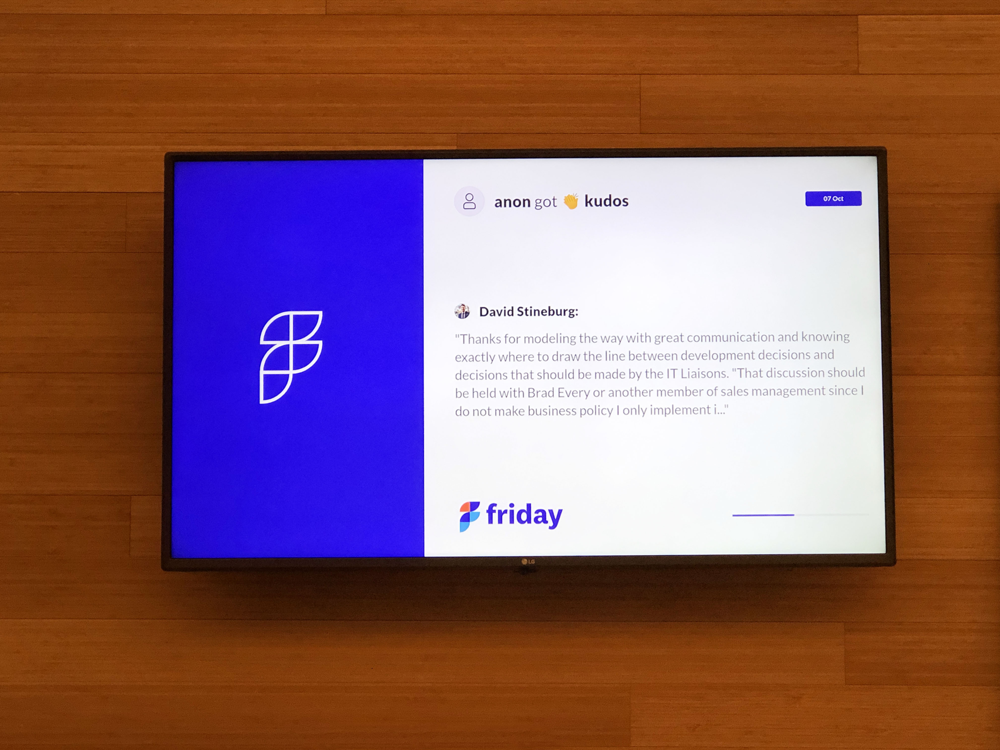
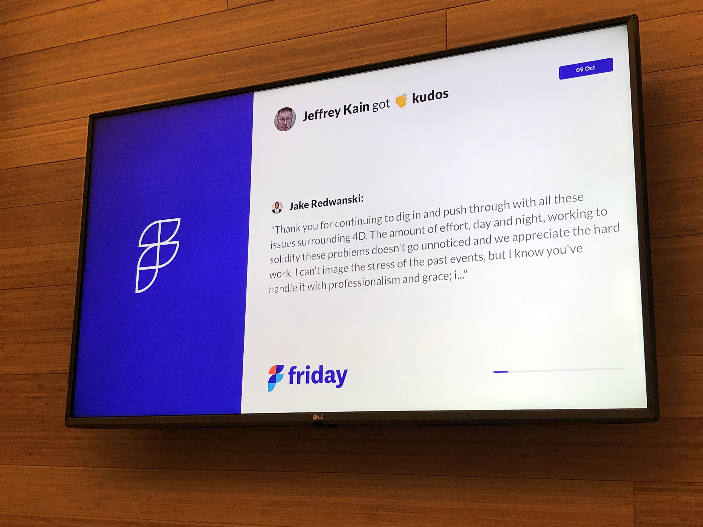
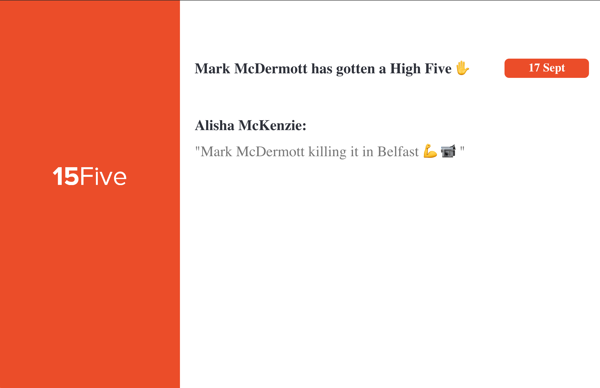

At ScreenCloud our goal is to enable our users to create and control their content on one, or many, screens easily.
Within our platform we have 80+ applications many of which allow users to easily integrate with 3rd party applications and tools such Dropbox,
Youtube, Google Sheets, Microsoft Excel, Microsoft One Drive, Facebook and many many more. But we are very aware that users may wish to create 
their own bespoke applications which solve a certain problem they have or maybe want to integrate with 3rd party applications or tools
they use which are not current available in ScreenClouds App Store. We have gone to great lengths to make this as straight forward as possible 
providing detailed instructions as well as for a fully fledged working coded example application which is integrated with 15Five - 
on how to create your own 15Five application see [https://screencloud.github.io/developer/firebase-react-app](https://screencloud.github.io/developer/firebase-react-app)

Below are a number of examples of applications which have been created and hosted by ScreenCloud customers themselves, they were created to 
integrate with 3rd party tools and applications being used within the various companies.

## Staffbase integration application created by Choate Construction

The Choate app connects the news feed from Choate Construction’s Staffbase mobile app with ScreenCloud. Display employee generated content seamlessly onto your screens, 
driving engagement and boosting staff morale.

## Friday integration application created by Sweetwater

The Sweetwater Sound app connects the Friday remote work tool with ScreenCloud. Display Kudos sent between employees seamlessly on your screens, 
driving engagement and boosting staff morale.

## 15Five integration application created by a developer at ScreenCloud

The 15Five ScreenCloud internal app connects the 15Five tool with ScreenCloud. Display High Fives sent between employees seamlessly on your screens, 
driving engagement and boosting staff morale.

