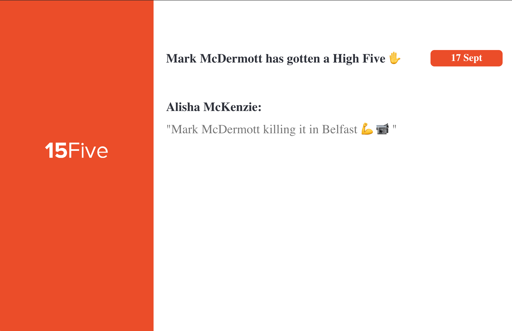
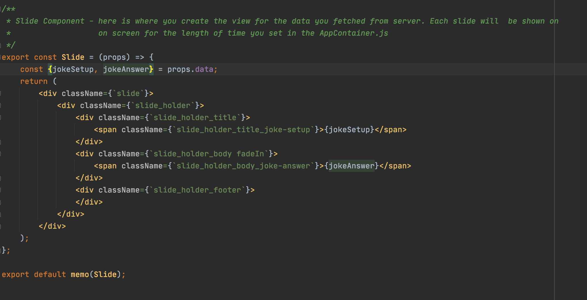

At ScreenCloud our goal is to enable our users to create and control their content on one, or many, screens easily. To help
users create their own application to be shown on their screens we have put together this tutorial on how we created an application which is used 
internally within ScreenCloud. The application uses 15Fives's api to show High Five's employees receive from their peers within the company. 
If you want to learn more about 15Five see [15Five](https://www.15five.com/)  

The application we are going to create will show each High Five on screen for 10 seconds, it will move through the list of High Fives one after the other
and will fetch data every 10 minutes to get new High Fives that have been given. This 'slideshow' kind of app is a very common use case for displaying data on screens.



The tutorial will give you a step by step guide on how to create the application, how to host it on firebase and how to then get the application showing within
ScreenCloud Studio App Store within your own organization. 

You can find the code for this tutorial here - for web application: [https://github.com/screencloud/developer/tree/master/examples/15five-firebase-webapp-example](https://github.com/screencloud/developer/tree/master/examples/15five-firebase-webapp-example)  
and for the cloud function: [https://github.com/screencloud/developer/tree/master/examples/15five-firebase-cloud-function-example](https://github.com/screencloud/developer/tree/master/examples/15five-firebase-cloud-function-example)  

## How ScreenCloud applications work on screen


The diagram above shows how the application is displayed on screen and how we get the 15Five data, which is used in the app. The app shown on the screen is a simple web application
written using Javascript and ReactJs. This application is loaded on screen within our ScreenCloud player, you can think of this as a browser that loads the application
within an iframe. The player passes configuration data set in Studio when creating the application instance and shows the app on screen. The web app itself
fetches its data periodically from the third party api, which in the case is 15Five. From the diagram you can see that we do not call the api directly from the web app on screen
instead we call a firebase cloud function which in turn calls the api endpoint for the data, we do this because with 3rd party api's you generally
need to create an api key or access token which allows you to be able to use their api and for security reasons this should never be exposed on the frontend. Firebase allows us to store this
key/value in its configuration store securely and be used by the cloud function for each call. We will show you how this is done later in the tutorial.

## Getting started with Firebase

We will be hosting the web application using firebase and we will also be creating a firebase cloud function to fetch the data from the 15Five api. 

To get started we create a firebase account and then set up a project for our application. We will call it screencloud-15five. We create the account and project here [Firebase](https://firebase.google.com/) 

Just follow the instructions to create the firebase account and create the project. Just create an empty project there is no need to add a web application or anything else through the firebase console,
later in the tutorial we will show you how we add a web application and cloud function to the firebase project through the command line. 

## Creating Firebase cloud function

We will start by creating a cloud function which will be used to fetch the data we require from the api. From the command line do the following on command line:

1. create a folder which will hold your cloud function code
```shell
mkdir screencloud-15five-mw
```
2. install the firebase-cli - this is used for all our firebase actions including creating, running locally and deploying cloud functions
```shell
npm install -g firebase-tools
```
3. login to firebase 
```shell
firebase login
```
4. create firebase cloud function - enter command below and follow instructions shown on screen to link cloud function to your firebase project
```shell
firebase init functions
```

Once done you will see a 'functions' folder now created containing all the code for the cloud function, there will be example hello world code for a simple cloud function found in functions/index.js
The code we added to the index.js file for the cloud function can be found here [https://github.com/screencloud/developer/tree/master/examples/15five-firebase-cloud-function-example](https://github.com/screencloud/developer/tree/master/examples/15five-firebase-cloud-function-example)  
Also copy over the dependencies from the package.json file to the package.json file of your own project.

To run this locally you will need your own 15Five api key which can be retrieved by following these instructions on the 15Five site [https://success.15five.com/hc/en-us/articles/360002699631-API](https://success.15five.com/hc/en-us/articles/360002699631-API) 

You will have to add your api key to the code replacing the TOKEN value with that of your own. For now just hardcode it here but later when we talk about deploying the function we will show you how to add the value to the Firebase configuration store meaning it will
not be visible to anyone who does not have access to your Firebase project.

To run the function locally, while under the functions directory:

1. install dependencies 
```shell
npm install
```
2. run the function
```shell
firebase emulators:start --only functions
```
3. navigate to http://localhost:5001/screencloud-15five/us-central1/highFives in browser

You should now see a list of your High Fives, similar to below:


## Creating ScreenCloud web application to be shown on screen

The app which shows the data on screen is a simple web applocation , we will be creating the application using Javascript and React, 
so first things first we must create a React app. Enter the following in the command line:

```shell
npx create-react-app screencloud-15five
```

This will create the base code for your React App. Since we are creating a 'Slide Show' style application and this is a very common type of app used to display information
on screens. We have put together an example application which with a few changes can help create your own bespoke 'Slide Show' style app using your own data. The code for this can be found here:
[https://github.com/screencloud/developer/tree/master/examples/react-firebase-example](https://github.com/screencloud/developer/tree/master/examples/react-firebase-example)  

Copy over the src folder into your newly created application, as well as the dependencies found in the package.json to the package.json of your new project.

```shell
npm install
npm start
```

You can then load the site in your web browser on: [http://localhost:8000/](http://localhost:8000/)

This application is a very simple joke app but you will see that the jokes appear on screen for 10 seconds at a time and move on to next like a slide show.

So now what changes do we have to make in this application to get it to work to display our 15Five High Fives:

1. src/components/data-loader/DataLoader.js

The DataLoader component is used to fetch the data from the middleware, by making a http request every 5 minutes.
To make this fetch data for the 15Five High 5 data, all we have to do is change the FETCH_DATA_URL to the url of the cloud function which fetches the data from the 15Five api
and changing the implementation of the mapModelToViewModel function which will take only the fields we need for the actual app view from response and map
to a view model which we can use to display the High 5s. See below:

From:


To:


2. src/components/slide-show/Slide.js

The slide component is where we write the code for the UI and will be what is shown to the users, the component takes in data in form we set in the 
mapModelToViewModel function in the previous step. See below:

From:


To:


## Deploying ScreenCloud web application on Firebase

Now that we have the web application done we need to deploy it firebase to be hosted.

To deploy the web app do the following:

1. login to firebase cli
```shell
firebase login 
```
2. Navigate to the root folder of the frontend codebase

3. Create a production build of the app
```shell
npm run build
```

4. Deploy the web app
```shell
firebase deploy --only hosting
```


## Creating Firebase cloud function

To deploy the middleware (cloud function) do the following:

1. login to firebase cli
```shell
firebase login 
```

2. Navigate to the functions folder of the middleware codebase

3. Install dependencies
```shell
npm install
``` 

4. Deploy functions
```shell
firebase deploy --only function
```

You will also want to set the api token in firebase configuration store by doing following:

```shell
firebase functions:config:set five.token="INSERT THE API TOKEN HERE"
```

The api token then is referenced in the code by calling functions.config().five.token, which retrieves the token from the store.

## Conclusion

Congratulations you have now created your very own ScreenCloud application, the only thing you need to do
now is to make a request to get the app added to your organizations App Store and you are good to go. Here at ScreenCloud we aim
to make developing your own apps as easily as possible, we hope that is tutorial was helpful and happy coding :) 