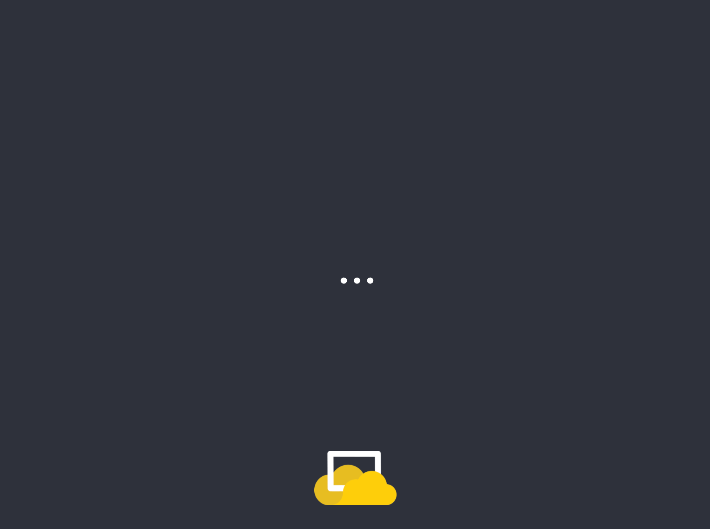

Before we start; you will need an account on [ScreenCloud Studio](https://studio.screencloud.com/). You can sign up for a free trial on ScreenCloud.com.

Custom apps for the legacy Signage product are not supported.

## Build Your Own "Dad Jokes" App


Sick of Hello World apps? Us too.

This app will display a random joke on screen. We'll use the super, free API at [icanhazdadjoke](https://icanhazdadjoke.com/) to power this.

We'll also ask users in Studio for a `refreshTimeSeconds` setting. We can then routinely update the quote after this time.

At this point, you will have connected up all of the pieces you need to build an app. You can then carry on like you would with any other webapp, integrating with your own tools and services.

## 1 - Get an App to Work On

The first step is getting an app in the App Store. This will let you see a new tile in the Store which points to your own deployed webapp.

Submit the [Develop an App](https://docs.google.com/forms/d/e/1FAIpQLScBlxBq-1NhQzD1v7FkjDrdLVNTq0FkwJwYgnj_IprRxH2dww/viewform) form, and we'll create the app on your organization in no time. You only need to give a name and where you plan to deploy to.

In the "What configuration fields do you need?" question, lets request the name field from above:

> "Joke Duration (seconds) - refreshTimeSeconds - Number field"

(Sorry, we know this manual step is far from ideal. We're working on a instant self-service option as well)

## 2 - Start from an Existing Web App

In many cases, you will build your app as a normal web app first. You can use any tools, frameworks and build process (Webpack, Gulp etc) you like.

In our case, the starting codebase is available here:

[https://github.com/screencloud/developer/tree/master/examples/starting-from-webapp](https://github.com/screencloud/developer/tree/master/examples/starting-from-webapp)

You can copy this folder, then run:

```shell
npm install
npm start
```

You can then load the site in your web browser on: [http://localhost:8000/](http://localhost:8000/)

## 3 - Install the SDK

Now, let's add ScreenCloud to the mix.

```shell
npm install @screencloud/apps-sdk
```

or

```shell
yarn add @screencloud/apps-sdk
```

## 4 - Connect to the Player

The Player is the code that runs your app.

It does this by loading your app in an `iframe`, so the first step for any app is to connect back to the Player to say "I'm ready, send me data!"

We want this code to run right at the start of our app. Open `index.js`, then scroll to the bottom for a function called `start`.

```javascript
function start() {
  const refreshTime = 10000;

  setInterval(updateQuote, refreshTime);
  updateQuote();
}
```

Let's call the `connectScreenCloud()` method. It returns a [Promise](https://developer.mozilla.org/en-US/docs/Web/JavaScript/Guide/Using_promises), which will resolve when your app is successfully connected to the Player and has all the data it needs to start.

We'll use async/await here, but you can of course use the `sc.then(() => { ... })` syntax if you prefer.

```javascript
// Top of your file
import { connectScreenCloud } from '@screencloud/apps-sdk';

// Note we added "async" here.
async function start() {
  const sc = await connectScreenCloud();
  const refreshTime = 10000; // This line won't run until the line above finishes successfully.

  ...
}
```



Wait, what happened?

## 5 - Local Test Data

If you were to debug your app now, you'd find that the `connectScreenCloud()` method never actually resolves.

Ah, we aren't running in a Player!

Local development is easier if we can run just our app most of the time, so the SDK offers a way to solve this. We can pass the data to `connectScreenCloud()`, but we need to make sure our code for this only runs in development.

In our case, the only field we asked for above was called `refreshTimeSeconds`, so let's create some local config with a default value of 7 seconds.

```javascript
async function start() {
  let testData;

  // NODE_ENV is a Node variable, which is likely already set properly by your build tool.
  if (process.env.NODE_ENV === "development") {
    testData = {
      // Config is all we want to stub out here. Your configuration form in Studio will later need to generate exactly this sort of object.
      config: {
        refreshTimeSeconds: 7,
      },
    };
  }

  const sc = await connectScreenCloud(testData);
  ...
}
```


Boom! Back in business.

Now, let's use our config value, not the hard-coded one.

Look for this line:

```javascript
const refreshTime = 10000;
```

And replace it with:

```javascript
const refreshTime = sc.getConfig().refreshTimeSeconds * 1000;
```

Your app should now be running again locally, but now it will run on a real Player and take user configuration too!

This is all you need to do. You can now deploy your app, then install it in Studio and see it up on screen!
