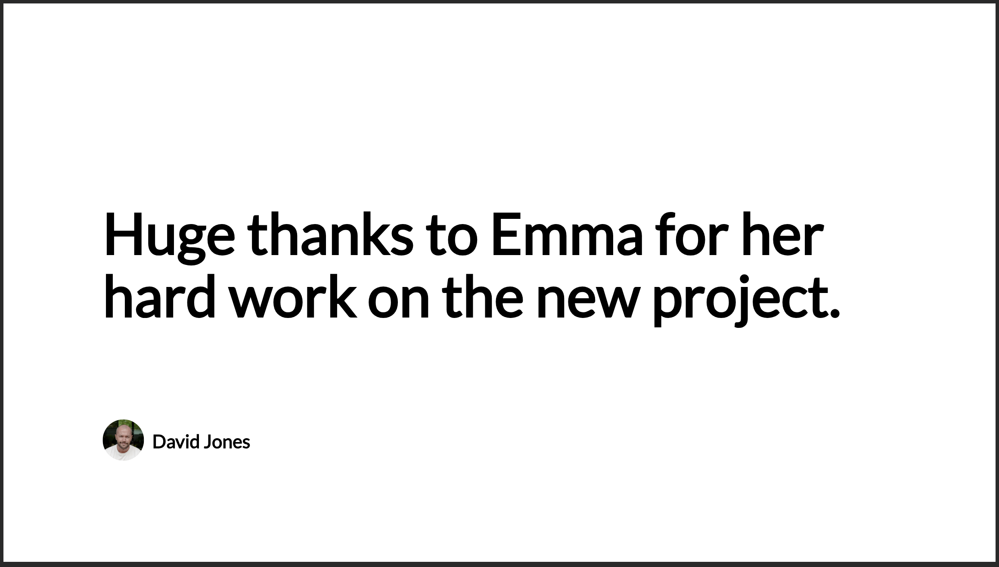

# Setting Up the App Instance

Begin by installing the webhooks app from the Studio App store. Once you've named your instance, you'll get a unique webhook URL and an API key, both essential for sending webhook requests.

Here's what your unique webhook URL will look like:

```
https://apps-api-feeds.{region}.screencloudapps.com/v1/hooks/{uniqueId}
```

Your API key will be a 24-character alphanumeric string (to be determined), such as:

```
S8IjvxXE1x6PcwvmClcVfH6r
```

# Sending a Webhook Request

After obtaining your unique webhook URL and API key, you're all set to send your webhooks. You should `POST` all webhooks to your designated URL, including the API key within the `X-API-Key` header:

```shell
POST /v1/hooks/AnzLxehpCwCQFmggRhEm4xfuJh5xFvxV HTTP/1.1
Host: apps-api-feeds.eu.screencloudapps.com
X-API-Key: {API_KEY}
```

# Webhook Data Format

Ensure you send the content of your webhook in the JSON format within the request body to the specified URL. The structure of your data payload is crucial and should adhere to the following schema:

```json
{
  "items": [
    {
      "itemId": "12345",
      "dateCreated": "2024-02-01T12:00:00Z",
      "lastEditedTime": "2024-02-01T12:30:00Z",
      "messageUrl": "https://example.com/message/12345",
      "author": {
        "displayName": "David Jones",
        "profileImage": {
          "url": "https://example.com/profiles/davidjones.jpg"
        }
      },
      "content": {
        "title": {
          "content": "Sample Title"
        },
        "body": {
          "content": "This is a sample body content for the hook."
        }
      },
      "attachments": [
        {
          "contentType": "image",
          "url": "https://example.com/images/sample.jpg"
        }
      ]
    }
  ]
}
```

## Webhook Params

| Name                      | Type       | Required | Description                                        |
| ------------------------- | ---------- | -------- | -------------------------------------------------- |
| `itemId`                  | `string`   | No       | You're own internal identifier.                    |
| `dateCreated`             | `string`   | No       | UTC date string item was created.                  |
| `lastEditedTime`          | `string`   | No       | UTC date string item was last edited.              |
| `messageUrl`              | `string`   | No       | Will generate a QR code to the message source URL. |
| `author.displayName`      | `string`   | No       | Display the author name.                           |
| `author.profileImage.url` | `string`   | No       | Display an author profile image.                   |
| `content.title.content`   | `string`   | No       | Title of the webhook post.                         |
| `content.body.content`    | `string`   | No       | Main body content of the webhook post.             |
| `attachments.url`         | `string[]` | No       | Accompanying image for thr webhook post.           |

> IMPORTANT: You must supply a `title`, `content` and/or `image`.

# Display Formats

Below are examples showcasing various display formats your webhooks will adopt when they appear on screen. The layout may vary slightly based on the content of your webhook. These illustrations aim to provide an overview of potential layouts.

<details>
  <summary>Show full content screenshot</summary>


</details>

<details>
  <summary>Show title only screenshot</summary>



</details>

<details>
  <summary>Show body only screenshot</summary>


</details>

<details>
  <summary>Show image only screenshot</summary>


</details>

# Error Responses

Every error response you get from a webhook `POST` will be in the format outlined below. Essentially, you'll be given a list of all errors detected in your `POST` request. Receiving any error means the request has failed, and your webhook wasn't processed. Address the errors and attempt the request once more.

```json
{
  "messages": ["At least one of title, body, or attachment is required"]
}
```
