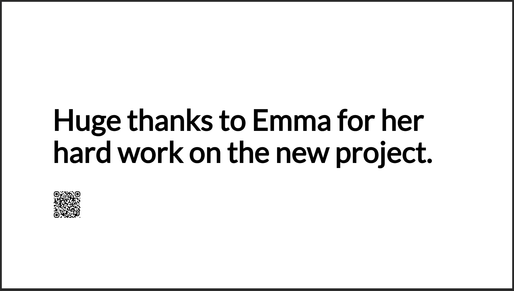

# Overview

You can use the ScreenCloud webhook app to develop custom inputs that can be pushed to Studio and utilise our core onscreen design language, ensuring your content looks great on screen. This guide will help get you setup.

# Setting Up the App Instance

Begin by installing the Webhooks app from the Studio App store. Create a new instance, after which you'll then name your webhook and click the Generate webhook button. This will return a unique webhook URL and an API key, both essential for sending webhook requests.

Here's what your unique webhook URL will look like:

```
https://apps-api-feeds.{region}.screencloudapps.com/v1/hooks/{uniqueId}
```

Your API key will be a 24-character alphanumeric string, such as:

```
S8IjvxXE1x6PcwvmClcVfH6r
```

**IMPORTANT:** Please make sure to record the API key, as you won't have the opportunity to view it again after navigating away from this page.

# Sending a Webhook Request

After obtaining your unique webhook URL and API key, you're all set to send your webhooks. You should `POST` all webhooks to your designated URL, including the API key within the `X-API-Key` header:

```
POST /v1/hooks/816ce4d8-c0cc-476b-8121-33e600e0e33e HTTP/1.1
Host: apps-api-feeds.eu.screencloudapps.com
X-API-Key: S8IjvxXE1x6PcwvmClcVfH6r
```

# Webhook Data Format

Ensure you send the content of your webhook in the JSON format within the request body to the specified URL. The structure of your data payload is crucial and should adhere to the following schema:

```json
{
  "items": [
    {
      "itemId": "12345",
      "dateCreated": "2024-02-01T12:00:00Z",
      "lastEditedTime": "2024-02-01T12:30:00Z",
      "messageUrl": "https://example.com/message/12345",
      "author": {
        "displayName": "David Jones",
        "profileImage": {
          "url": "https://example.com/profiles/davidjones.jpg"
        }
      },
      "content": {
        "title": {
          "content": "Sample Title"
        },
        "body": {
          "content": "This is a sample body content for the hook."
        }
      },
      "attachments": [
        {
          "contentType": "image",
          "url": "https://example.com/images/sample.jpg"
        }
      ]
    }
  ]
}
```

## Webhook Params

| Name                      | Type       | Required | Description                                        |
| ------------------------- | ---------- | -------- | -------------------------------------------------- |
| `itemId`                  | `string`   | No       | Your own internal identifier.                      |
| `dateCreated`             | `string`   | No       | UTC date string item was created.                  |
| `lastEditedTime`          | `string`   | No       | UTC date string item was last edited.              |
| `messageUrl`              | `string`   | No       | Will generate a QR code to the message source URL. |
| `author.displayName`      | `string`   | No       | Display the author name.                           |
| `author.profileImage.url` | `string`   | No       | Display an author profile image.                   |
| `content.title.content`   | `string`   | No       | Title of the webhook post.                         |
| `content.body.content`    | `string`   | No       | Main body content of the webhook post.             |
| `attachments.contentType` | `image`    | No       | Currently only supports `image`.                   |
| `attachments.url`         | `string[]` | No       | Accompanying image for the webhook post.           |

> You must supply at least one of the following fields: `content.title.content`, `content.body.content`, or `attachments.url`. Combinations of these fields are also acceptable.

# Display Formats

Below are examples showcasing various display formats your webhooks will adopt when they appear on screen. The layout may vary slightly based on the content of your webhook. These illustrations aim to provide an overview of potential layouts.

<details>
  <summary>Show full content screenshot</summary>


The example below demonstrates the simplest data structure you would `POST` to achieve the above result.

```json
{
  "items": [
    {
      "author": {
        "displayName": "David Jones",
        "profileImage": {
          "url": "https://example.com/profiles/davidjones.jpg"
        }
      },
      "content": {
        "title": {
          "content": "Welcome to our new London Office!"
        },
        "body": {
          "content": "We are excited to announce the opening of our new office in London. The new office is located in the heart of the city and will be the new home for our growing team. We ar elooking forward to welcoming our clients and partners to our new office."
        }
      },
      "attachments": [
        {
          "contentType": "image",
          "url": "https://example.com/images/sample.jpg"
        }
      ]
    }
  ]
}
```

</details>

<details>
  <summary>Show title only screenshot</summary>


The example below demonstrates the simplest data structure you would `POST` to achieve the above result.

```json
{
  "items": [
    {
      "content": {
        "title": {
          "content": "Huge thanks to Emma for her hard work on the new project."
        }
      }
    }
  ]
}
```

</details>

<details>
  <summary>Show body only screenshot</summary>


The example below demonstrates the simplest data structure you would `POST` to achieve the above result.

```json
{
  "items": [
    {
      "content": {
        "body": {
          "content": "Happy Anniversary to Richard. 2 years at the company today. Thanks for all your hard work!"
        }
      }
    }
  ]
}
```

</details>

<details>
  <summary>Show image only screenshot</summary>


The example below demonstrates the simplest data structure you would `POST` to achieve the above result.

```json
{
  "items": [
    {
      "attachments": [
        {
          "contentType": "image",
          "url": "https://example.com/images/sample.jpg"
        }
      ]
    }
  ]
}
```

</details>

<details>
  <summary>Show title and QR code screenshot</summary>



The example below demonstrates the simplest data structure you would `POST` to achieve the above result.

```json
{
  "items": [
    {
      "messageUrl": "https://example.com/some-page/",
      "content": {
        "title": {
          "content": "Huge thanks to Emma for her hard work on the new project."
        }
      }
    }
  ]
}
```

</details>

# Error Responses

Every error response you get from a webhook `POST` will be in the format outlined below. Essentially, you'll be given a list of all errors detected in your `POST` request. Receiving any error means the request has failed, and your webhook wasn't processed. Address the errors and attempt the request once more.

```json
{
  "messages": ["At least one of title, body, or attachment is required"]
}
```

# Code Example

The example below demonstrates how to send a webhook using cURL. Just swap out the placeholders (like the URL and API key) with your own information gathered from the initial setup step to trigger the webhook.

```shell
curl --location 'https://apps-api-feeds.eu.screencloudapps.com/v1/hooks/816ce4d8-c0cc-476b-8121-33e600e0e33e' \
--header 'X-API-Key: S8IjvxXE1x6PcwvmClcVfH6r' \
--header 'Content-Type: application/json' \
--data '{"items":[{"itemId":"12345","dateCreated":"2024-02-01T12:00:00Z","lastEditedTime":"2024-02-01T12:30:00Z","messageUrl":"https://example.com/message/12345","author":{"displayName":"David Jones","profileImage":{"url":"https://example.com/profiles/davidjones.jpg"}},"content":{"title":{"content":"Sample Title"},"body":{"content":"This is a sample body content for the hook."}},"attachments":[{"contentType":"image","url":"https://example.com/images/sample.jpg"}]}]}'
```
